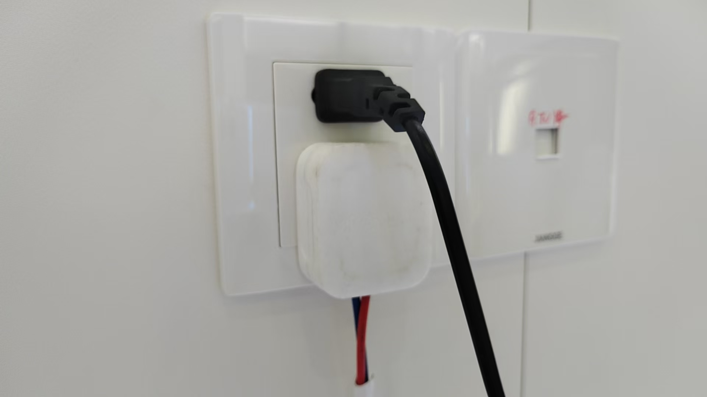
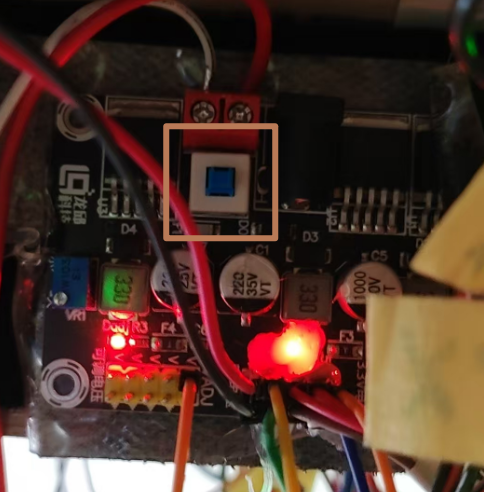
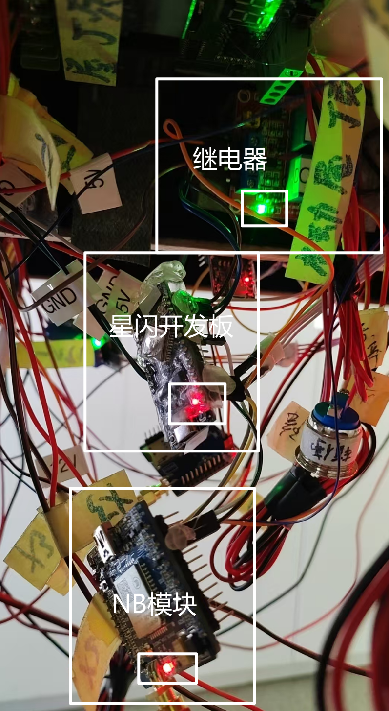
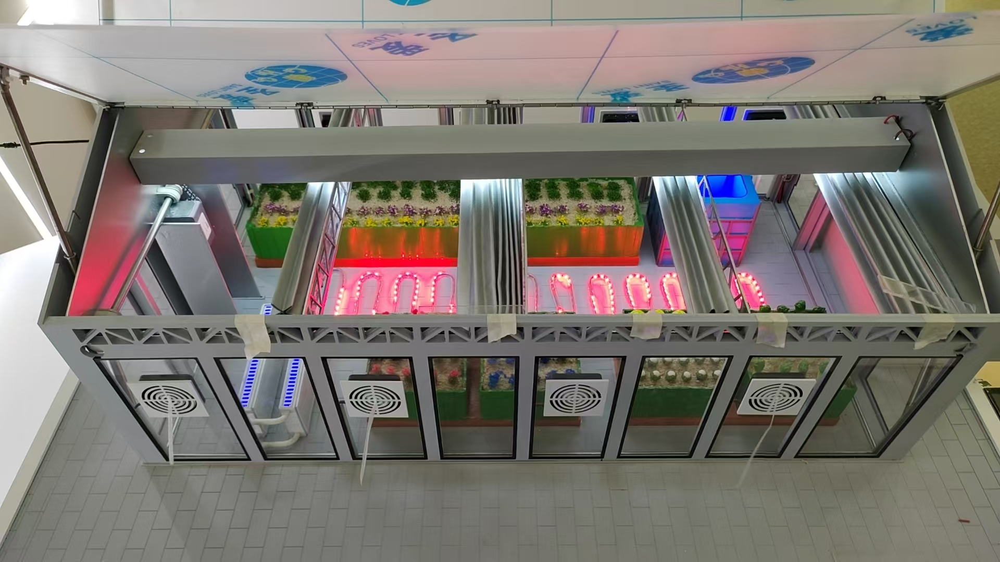
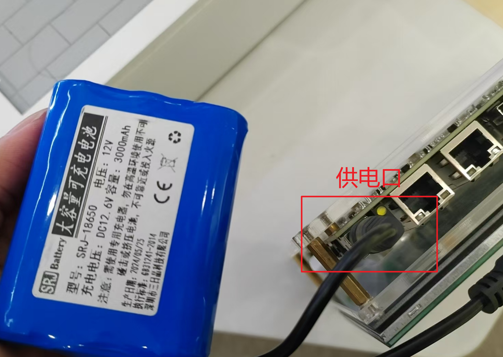
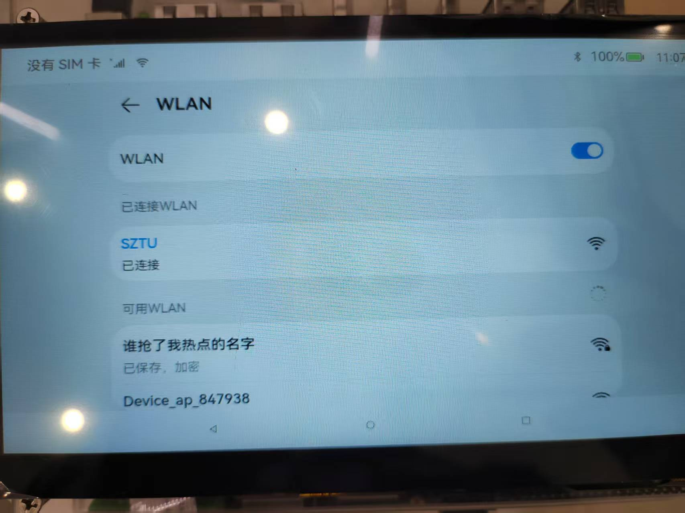
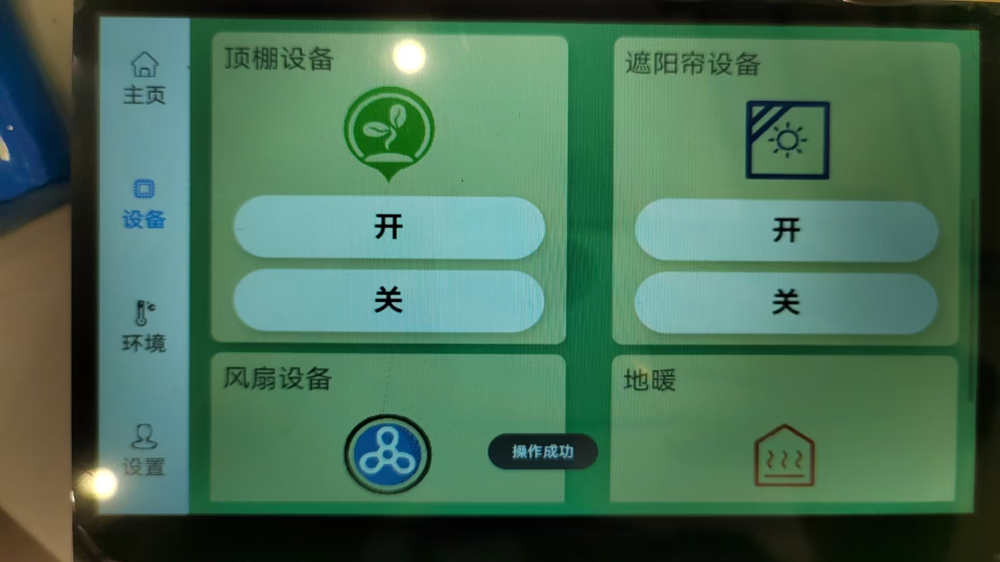
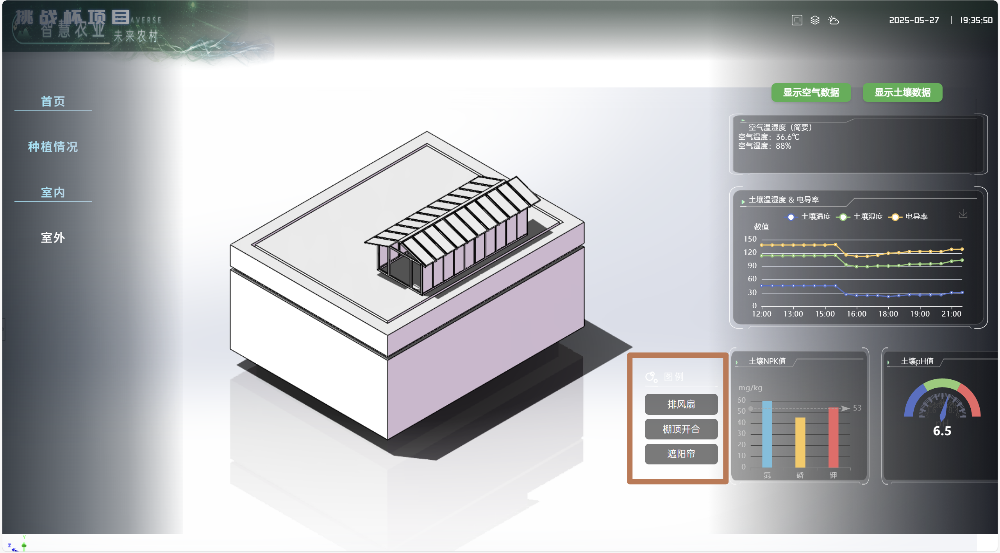
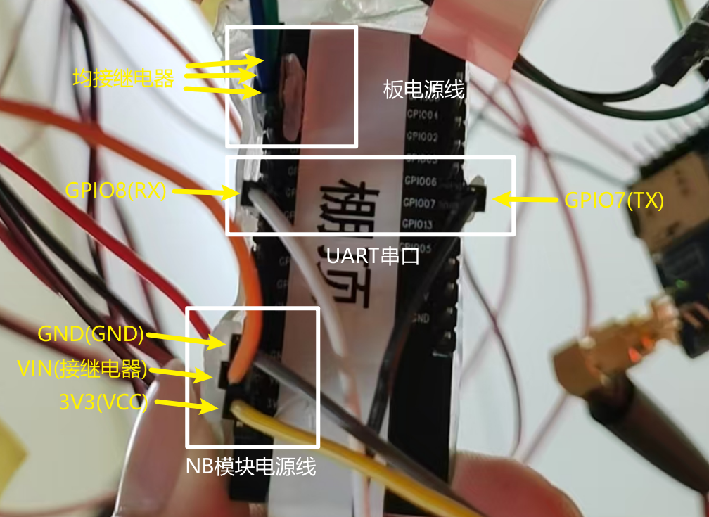
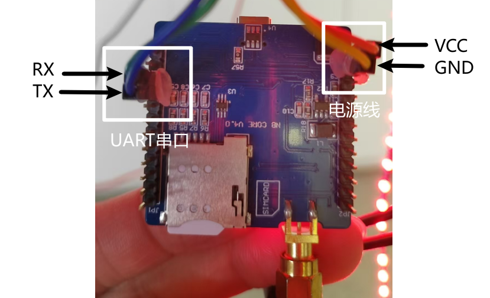

# 智慧大棚沙盘操作流程

## 设备上电

将白色的三孔插头和黑色的两孔插头(*顶棚供电*)均插上插座

## 板子上电

控制设备的开发板以及NB模组需要按下电源控制模块上的按钮才能上电

可以观察星闪开发板、NB模块以及继电器是否亮电源LED灯

确认均通电后，等待开发板自启动。听到继电器发出声音后，观察风扇、地暖是否打开，顶棚和遮阳帘是否为开启状态，是则证明开发板初始化成功；否则查看接线，详细可见**第五部分**，或重新上电。

## APP平台使用

使用12V的电池对RK3588开发板进行供电，等待设备启动

启动完毕后将开发板连接至可用WIFI，如**校园网**或**个人热点**( *若在校园网下点击控制按钮无反应，请优先换为个人热点*)

连接WIFI后，点击桌面label图标进入软件，无需输入账号密码，直接点击登录，切换至设备界面就可以对设备进行控制

### tips：

* **设备控制存在一定延迟，请不要多次点击**
* **顶棚控制存在电机冷却时间(*大概一两分钟左右*)，不要频繁点击**

## 网页平台使用

确保网络连接正常且可用后，打开任意浏览器，进入这个网址：[智慧农业网页平台](http://189.1.245.236:8090/#/home)

点击“室内”，在右下角可以对设备进行控制(*注意事项同第三部分*)

## 常见问题

* 需按下电源控制模块上的开关才能给开发上电
* 控制顶棚的开发板由于杜邦线的缘故存在接触不良，可调整板子位置保持LED亮起
* 控制设备时弹出“操作失败”请先检查WIFI是否正常连接且可用，若还是不行则联系负责人员

## 接线须知

如果线材不小心脱落，请先**按下电源控制模块上的开关断电，再拔下两个插头**再进行接线操作

### 星闪开发板

星闪开发板接线较多，可以分为三个部分，分别是板电源线(接继电器)，UART串口线(GPIO7,GPIO8)，NB模块电源线(3V3,GND)

其中括号内为NB模块上对应的引脚，其余需接继电器的部分出问题请**断电**后联系负责人员

### 继电器

继电器接线相对复杂，出现问题请**断电**后联系负责人员，在此不作展开，

### NB模块

NB模块仅有四根线，分别为<u>电源线</u>(*VCC,GND*)，<u>UART串口线</u>(*RX,TX*)接线如下图

### 电源控制模块

电源控制模块由于接线过多，任意出现接触不良或线材脱落的情况，可以按照线材上的标签进行接线

电源模块从左到右依次为12V、5V、3V3、上排针脚为VCC(*接正极*)，下排为GND(*接负极*)